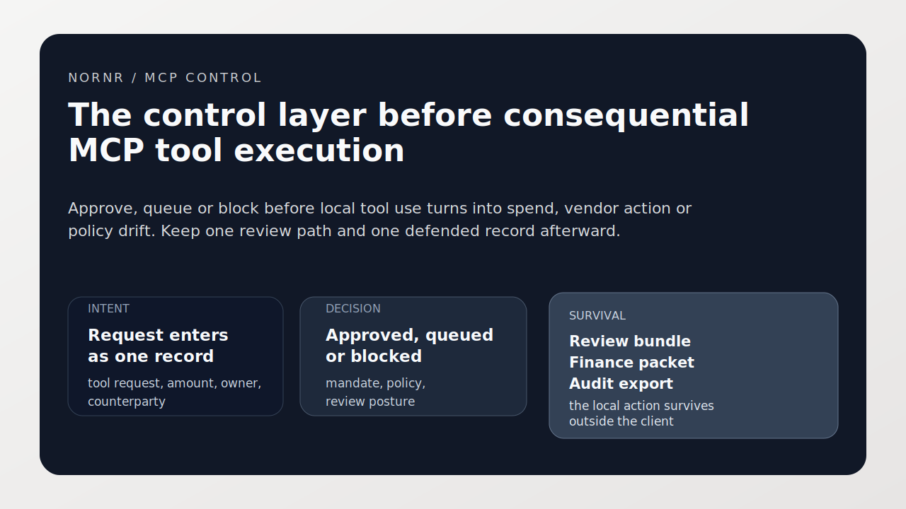
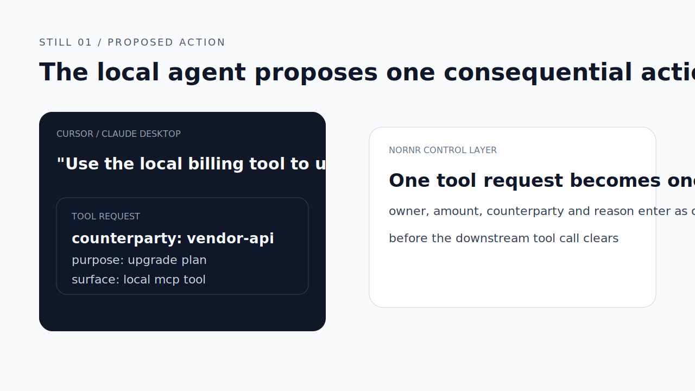
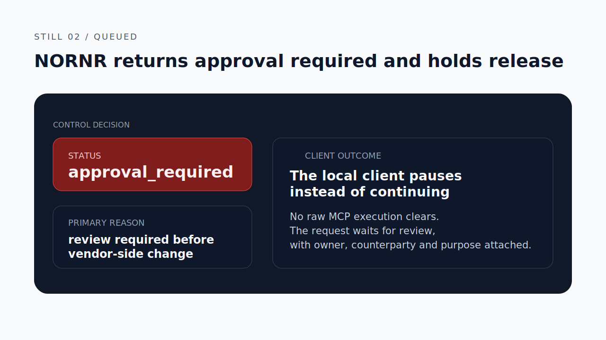
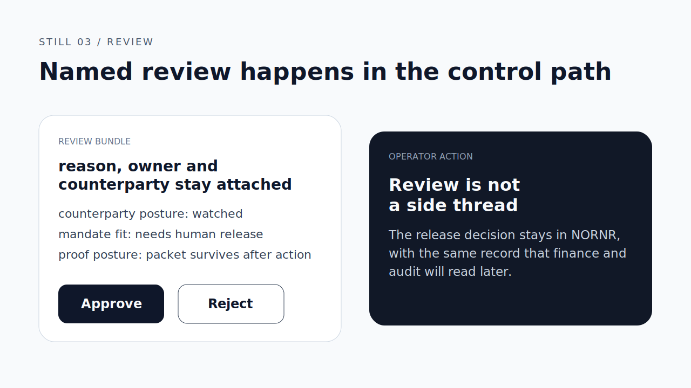
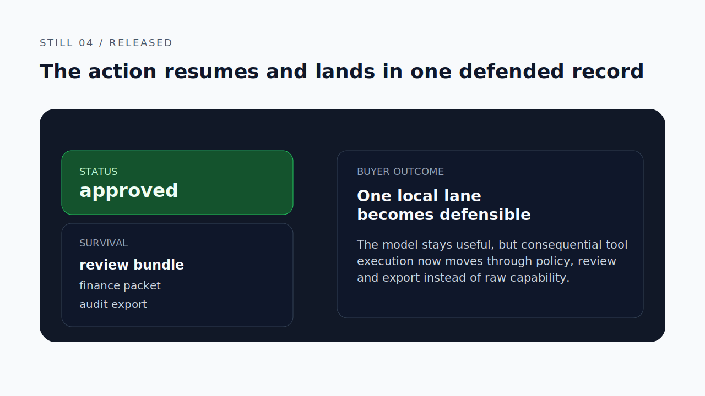

# NORNR MCP Control

[](https://nornr.com/mcp-control-server)
[](https://nornr.com/mcp-config-generator)
[](https://nornr.com/community-policy-packs)
[](https://nornr.com/nornr-vs-raw-mcp-tools)

Official public MCP package for NORNR, the control layer before consequential MCP tool execution.

This repo is intentionally thin.

It exists to make NORNR easy to discover, install and evaluate from MCP-native surfaces such as:

- Claude Desktop
- Cursor
- Agent Zero
- OpenClaw / ClawHub
- custom local MCP clients

The governance logic lives in the official NORNR Python SDK:

- SDK repo: [NORNR/sdk-py](https://github.com/NORNR/sdk-py)
- Package: `nornr-agentpay`

The shortest correct reading is:

- one local tool request becomes one NORNR intent
- NORNR decides whether it is approved, queued or blocked
- queued work enters named review with context attached
- the same action still survives into proof, finance packet and audit export later

## Emergency freeze

NORNR is not only the decision layer before execution.
It is also the emergency stop layer when a local lane becomes unsafe.

Use it when a desktop or local agent:

- starts looping on tool calls
- reaches a disputed or watched counterparty
- drifts into policy-sensitive actions
- needs to be held in review-only mode while an operator inspects the lane

The right mental model is not "best effort warnings."
It is controlled release, controlled pause and controlled recovery.

## What this is

NORNR is not another MCP tool.

It is the control layer above consequential MCP tools.

That means:

- one tool request becomes one NORNR intent
- policy decides whether it is approved, queued or blocked
- queued work lands in review with context attached
- the resulting action still survives into proof, finance close and audit export

## What this is not

This repo is not:

- a new control-plane implementation
- a separate NORNR backend
- a raw tool catalog
- a wallet wrapper

It is a public install surface for the official NORNR MCP control server.

## Why raw MCP tool execution is not enough

Raw MCP tool execution exposes capability.
It does not answer the harder questions:

- should this action clear under the active mandate
- who reviews it when it should queue
- what record survives after the action completes

NORNR adds the missing layer before the downstream tool, provider or vendor step clears.

## Hello world

1. Install the dependency:

```bash
python -m pip install -r requirements.txt
```

2. Set your NORNR key:

```bash
export NORNR_API_KEY="replace-with-your-key"
export NORNR_BASE_URL="https://nornr.com"
export NORNR_AGENT_ID="desktop-agent"
```

3. Print a copy-paste config:

```bash
python nornr_mcp_control.py claude-config
```

4. Run the server over stdio:

```bash
python nornr_mcp_control.py serve
```

## Copy this config

### Claude Desktop

```json
{
  "mcpServers": {
    "nornr": {
      "command": "python3",
      "args": [
        "/absolute/path/to/nornr_mcp_control.py",
        "serve"
      ],
      "env": {
        "NORNR_API_KEY": "replace-with-your-key",
        "NORNR_BASE_URL": "https://nornr.com",
        "NORNR_AGENT_ID": "desktop-agent"
      }
    }
  }
}
```

### Cursor

```json
{
  "mcpServers": {
    "nornr": {
      "command": "python3",
      "args": [
        "/absolute/path/to/nornr_mcp_control.py",
        "serve"
      ],
      "env": {
        "NORNR_API_KEY": "replace-with-your-key",
        "NORNR_BASE_URL": "https://nornr.com",
        "NORNR_AGENT_ID": "cursor-agent"
      }
    }
  }
}
```

Use the generator commands if you want the exact JSON from the SDK:

```bash
python nornr_mcp_control.py claude-config
python nornr_mcp_control.py cursor-config
python nornr_mcp_control.py manifest
```

## Cursor rule

Add this to `.cursorrules` if Cursor is allowed to use local tools through NORNR:

```text
Use NORNR as the control layer before consequential tool execution.
Do not proceed with a paid, vendor-side or policy-sensitive action until NORNR returns approved or a named operator explicitly approves the queued intent.
Treat queued, blocked, anomalous or review-required posture as a stop state for autonomous execution.
```

## Prompt injection does not override mandate

Prompt injection can change what the model wants to do.
It should not change what the lane is allowed to do.

That is why NORNR sits above execution:

- prompt pressure does not create approval
- model persuasion does not widen mandate
- a risky tool request can still be queued or blocked even if the model insists
- counterparty posture and review requirements still survive into the same record

The right promise is not "the model becomes safe."
It is that the control layer still holds when the model becomes unreliable.

## Still sequence

The fastest visual explanation is the same four-step still sequence every time:






## Default policy pack

Start from `mcp-local-tools-guarded`.

That is the default first posture when a local MCP client can reach:

- paid providers
- vendor APIs
- local tools with external side effects
- policy-sensitive account actions

The goal is not to govern every local action on day one.
The goal is to install one defended local lane first.

## What happens after queued

Queued does not mean proceed carefully.
It means stop the autonomous path and route it into review.

1. Keep the downstream tool action on hold.
2. Inspect the queued basis in NORNR.
3. Review counterparty posture, amount, purpose and mandate fit.
4. Approve or reject explicitly.
5. Let the resulting action survive into proof, finance packet and audit export later.

## Operating rule

Do not let the MCP client proceed with a consequential tool action until NORNR returns `approved` or a named operator explicitly approves the queued intent.

Treat queued, blocked, anomalous or prompt-risk posture as review states, not autonomous green lights.

## Files

- `nornr_mcp_control.py` — thin stdio MCP server wrapper
- `requirements.txt` — pinned NORNR SDK dependency
- `SECURITY.md` — dependency provenance and key-scope guidance
- `configs/` — copy-paste client snippets
- `.cursorrules.example` — Cursor operating rule example

## Provenance

This repo stays intentionally small.

The actual control-plane logic is delegated to the official NORNR Python SDK:

- package: `nornr-agentpay==0.1.0`
- import path: `agentpay`
- source: [NORNR/sdk-py](https://github.com/NORNR/sdk-py)

If your team requires dependency review, inspect the pinned SDK release before enabling this server in production workflows.

## Public links

- MCP package page: [nornr.com/mcp-control-server](https://nornr.com/mcp-control-server)
- MCP config generator: [nornr.com/mcp-config-generator](https://nornr.com/mcp-config-generator)
- Claude Desktop guide: [nornr.com/guides/claude-desktop-mcp-control-server](https://nornr.com/guides/claude-desktop-mcp-control-server)
- Cursor guide: [nornr.com/guides/cursor-mcp-control-server](https://nornr.com/guides/cursor-mcp-control-server)
- Raw MCP comparison: [nornr.com/nornr-vs-raw-mcp-tools](https://nornr.com/nornr-vs-raw-mcp-tools)
- Quickstart: [nornr.com/quickstart](https://nornr.com/quickstart)

## License

MIT-0. See [LICENSE](./LICENSE).
